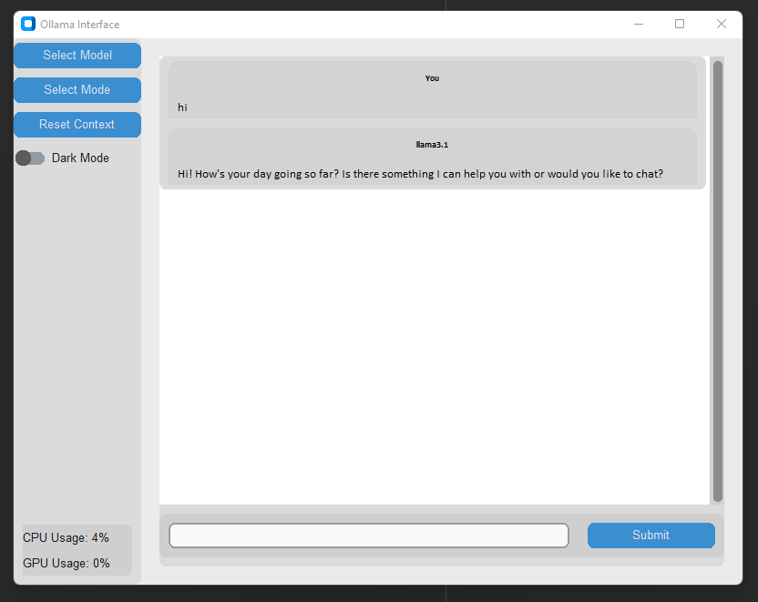

# Ollama-GUI

This project provides a graphical user interface (GUI) to interact with different models available in [Ollama](https://github.com/ollama/ollama). The GUI is built using `Tkinter` and `CustomTkinter` and allows users to select models, choose modes, submit prompts, and view generated responses in a user-friendly way. The interface also provides real-time monitoring of CPU and GPU usage.



## Features

- **Model Selection**: Choose from a list of available models.
- **Mode Selection**: Select different modes like `generate`, `chat`, or `code`.
- **Conversation History**: Keeps track of conversation context and displays it in a scrollable window.
- **Dark Mode Toggle**: Easily switch between light and dark modes.
- **Real-time Resource Monitoring**: Display current CPU and GPU usage.
- **Reset Context**: Clear the conversation history with a single click.

## Prerequisites

- Python 3.x
- Install required packages:

```bash
pip install customtkinter psutil GPUtil ollama
```

## Usage
### Clone the repository:

```bash
git clone https://github.com/your-username/ollama-gui.git
```
